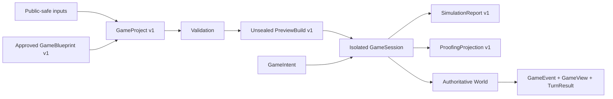

<div align="center">

# Lore2MUD

**把公开安全或已授权的故事材料，构建为确定、可验证、可重放的文字游戏。**

Agent-callable · Local-first · Deterministic · Public-safe

[](https://github.com/Ta1ended/lore2mud/actions/workflows/tests.yml)
[](https://github.com/Ta1ended/lore2mud/actions/workflows/quality.yml)


</div>

## 中文

Lore2MUD 是一个**供开发 Agent 调用的小说转文字游戏引擎**。

开发 Agent 通过 Python SDK、结构化 CLI 和 JSON Schema 创建游戏；产品所有者负责创意、
来源授权和发布决策；玩家通过文字 CLI 或本地 Web 客户端游玩。Lore2MUD 本身不是 Agent，
也不会在运行时用自由文本模型取代确定性规则。

### 当前状态

> 状态快照：2026-08-05。V2-2 已完成 TECH、PRODUCT 和 SECURITY 门禁，
> 但这不等于 release、`main` 集成或 V2-3 授权。

| 里程碑 | 交付内容 | 状态 |
|---|---|---|
| V1 | 内容包、权威 `World`、CLI/Web、玩法与存档 | 公开可用 |
| V2-1 | `GameIntent`、`GameSession`、事件、视图与回合结果 | 已验收 |
| V2-2 | Blueprint、Project、preview、simulation、proofing、SDK/CLI | 已验收 |
| V2-3 | capability catalog、版本与依赖解析 | 独立候选，未合并 |
| V2-4A | provenance/rights、anchor migration、package/evidence identity | 本地候选，未验收、未发布 |
| V2-5 | Agent workbench | 规划中 |

当前 V2-2 实现位于 `workstream/v2-2-agent-authoring`。它尚未成为 release，preview 也不是
可分发的 `GamePackage v2`。

V2-4A is a local contract candidate only. A successful `author seal` result is sealed
for deterministic identity and controlled runtime input, but remains
`distributable=false` and `release_evidence=false`; it grants no product, security,
rights, publication, or distribution approval.

### 已有能力

**运行时**

- 严格的多文件 JSON 内容包和 Schema 校验
- 房间、出口、物品门禁、背包、装备、商店、任务、对话与原子效果
- 确定性战斗、战利品、失败恢复和可选 runtime campaign
- save v9 写入，以及受约束的 v7/v8 读取兼容
- 文字 CLI、本地 Web 玩家端和 Windows 打包候选

**Agent 创作接口**

- typed `GameBlueprint v1`、`GameProject v1` 和 `AuthoringDiagnostic v1`
- 规范 JSON、稳定排序、SHA-256 和确定性 fingerprint
- 固定 V1 compatibility profile 的未封存 preview
- 隔离 `GameSession` 模拟、witness replay 和 save/load checkpoint 等价性
- `SimulationReport v1`、玩家安全的 admissible intents 和只读 proofing
- 调用同一 `AuthoringService` 的 Python SDK 与 structured CLI

### 架构



`World` 始终是玩法权威。SDK、CLI、Web、模拟和 proofing 不拥有第二套规则，也不能直接
修改活动玩家 session。

### 快速开始

需要 Python 3.11 或更高版本。

```powershell
git clone https://github.com/Ta1ended/lore2mud.git
cd lore2mud

python -m venv .venv
.\.venv\Scripts\Activate.ps1
python -m pip install -e .
```

校验并游玩完全原创的公开 Demo：

```powershell
python -m lore2mud validate --content examples/original_demo
python -m lore2mud play --content examples/original_demo
```

启动本地 Web 玩家端：

```powershell
python -m lore2mud web --content examples/original_demo
```

浏览器打开 `http://127.0.0.1:8765`。Demo 流程见
[`examples/original_demo/README.md`](examples/original_demo/README.md)。

### 使用 V2-2 Authoring

```powershell
git fetch origin
git switch --track origin/workstream/v2-2-agent-authoring
python -m pip install -e ".[test,quality]"
python -m lore2mud author --help
```

结构化命令包括：

```text
author create-project   创建规范化 GameProject v1
author validate         校验并规范化项目
author preview          构造固定 profile 的不可分发 preview
author simulate         运行隔离、确定性的模拟
author replay           重放并验证 SimulationReport witness
author proof            生成玩家安全的只读 proofing projection
author validate-provenance  校验公开安全 provenance/rights manifest
author validate-anchors     校验显式 story/scene/resume anchor migration
author seal                 生成不可发布的 sealed GamePackage v2 candidate
```

完整命令、SDK 和合同说明见
[`docs/v2/authoring_interface.md`](docs/v2/authoring_interface.md)。

### 重要边界

- Preview 未封存且不可分发，不是 `GamePackage v2`。
- Preview/report fingerprint 只证明可复现性，不是 package 或 release identity。
- V2-2 不解析 capability requirements；任何非空 requirement 都会阻止 preview/simulation。
- `CampaignSpec v1` 是 authoring IR，不是 runtime input 或 preview package。
- 游戏回合中不执行任意 Python、动态插件、生成代码或模型裁决。
- 私人小说、canon、派生内容、图片、存档和报告不进入公开仓库。
- MIT 许可证只覆盖仓库自有代码和原创材料，不授予外部内容权利。

### 仓库地图

```text
src/lore2mud/application/   typed runtime application layer
src/lore2mud/authoring/     V2-2 authoring contracts and services
src/lore2mud/engine/        authoritative gameplay and persistence
src/lore2mud/content/       strict content loading and validation
src/lore2mud/web/           local Web player
pipeline/                   deterministic V1 authoring compilers and Forge
schemas/                    public JSON Schema contracts
examples/                   original public content
tests/                      runtime, authoring, replay and packaging evidence
docs/                       formats, architecture, workflow and roadmap
```

### 开发

开始修改前请阅读 [`AGENTS.md`](AGENTS.md)、[`PRODUCT.md`](PRODUCT.md)、
[`PROJECT_STATE.md`](PROJECT_STATE.md)、[`NEXT_TASK.md`](NEXT_TASK.md) 和
[`CODE_MAP.md`](CODE_MAP.md)。

```powershell
python -m unittest discover
python -m pytest -q
python -m pytest -q -n auto
python -m ruff check .
python -m pyright
python -m compileall -q src pipeline scripts tests
python -m lore2mud validate --content examples/original_demo
python scripts/check_repo_safety.py --history
git fsck --full --no-dangling
git diff --check
```

本地测试通过不等于独立验收，也不自动授权 push、release、移动 `main` 或开始下一里程碑。

---

<details>
<summary><strong>English</strong></summary>

Lore2MUD is an **Agent-callable novel-to-text-game engine** for building deterministic,
inspectable, and replayable text games from public-safe or explicitly authorized material.

A developer Agent uses the Python SDK, structured CLI, and JSON contracts. The product owner
controls creative direction, rights, acceptance, and release. Players use the text CLI or local
Web client. Lore2MUD is not itself an Agent and does not replace deterministic runtime rules with
free-form model adjudication.

### Status

As of August 5, 2026, V2-2 has completed TECH, PRODUCT, and SECURITY gates. This does not
authorize release, `main` integration, or V2-3.

The accepted V2-2 workstream provides:

- typed `GameBlueprint v1`, `GameProject v1`, and stable diagnostics;
- canonical JSON, deterministic fingerprints, and fixed-profile previews;
- isolated `GameSession` simulation and replayable `SimulationReport v1` evidence;
- player-safe admissible intents and read-only proofing projections;
- one shared implementation exposed through the Python SDK and structured CLI.

Try the public runtime:

```powershell
python -m pip install -e .
python -m lore2mud validate --content examples/original_demo
python -m lore2mud play --content examples/original_demo
python -m lore2mud web --content examples/original_demo
```

Try V2-2:

```powershell
git fetch origin
git switch --track origin/workstream/v2-2-agent-authoring
python -m pip install -e ".[test,quality]"
python -m lore2mud author --help
```

Important boundaries:

- A preview is unsealed and non-distributable. It is not `GamePackage v2`.
- Preview/report fingerprints prove reproducibility, not package or release identity.
- Non-empty V2 capability requirements block preview and simulation until V2-3.
- `CampaignSpec v1` remains authoring IR and is never accepted as runtime input.
- Runtime turns execute no arbitrary Python, generated code, dynamic plugins, or model calls.
- Private source and owner-controlled derived artifacts remain outside public Git.

Read the [product definition](PRODUCT.md), [code map](CODE_MAP.md),
[V2 architecture](docs/v2/architecture.md),
[authoring interface](docs/v2/authoring_interface.md), and
[roadmap](docs/v2/roadmap.md).

Repository-owned code and original public examples are available under the
[MIT License](LICENSE). Imported, private, or generated material may have separate rights.

</details>
